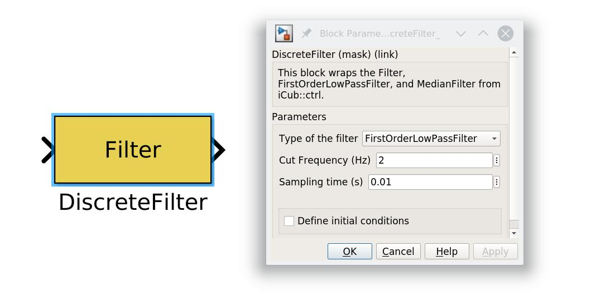
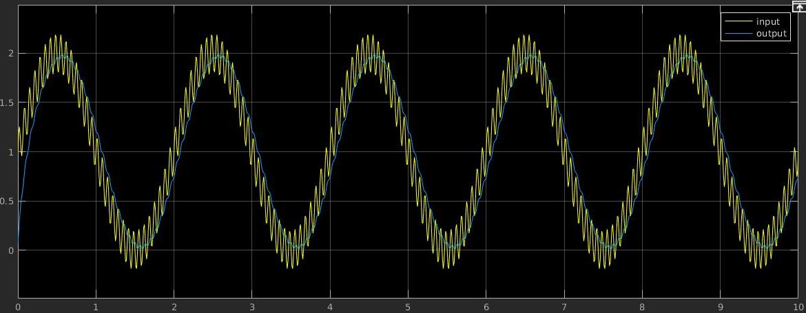
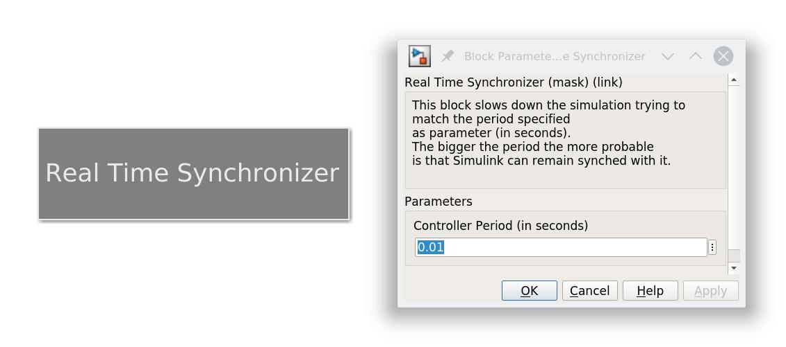

# Basic real-time Simulink model

!!! example
    You can find the Simulink model created in this tutorial in the [examples/](examples/) folder

Let's start from a blank Simulink model. By default, Simulink selects the solver based on the requirements of the blocks that are part of the model. In most cases, a variable-step solver is selected by default. The aim of the Whole-Body toolbox is developing discrete-time robot controllers, and variable-steps solvers are not compatible with this kind of constraint.

Open the model configuration, select a fixed-step solver, and set the step period for instance to 0.01 seconds:

This configuration forces the simulation loop that computes the output of all blocks to run at 100 Hz.

### Simulating a discrete filter

Now let's add a _Discrete Filter_ block that is provided by `WBT`. This block exposes a C++ class that implements few discrete-time filters. We are interested in using a simple low-pass, configure the block mask to use a cut-off frequency equal to 10 Hz as follows:

Now let's feed to the block two sine waves at different frequencies, one above and one below the cut-off frequency, plus a scope for visualising the signals:

Press the _Play_ button, wait the end of the simulation, and inspect the scope. You should obtain the following plot:

As expected, the high-frequency component has been attenuated by the low-pass filter.

### Real-time simulation

You might have noticed that the simulation runs accelerated. Despite the simulation time is 10 seconds, the simulation is executed to run as fast as possible. Robot controllers, beyond the need to run as discrete-time systems, have to be executed synchronously with the target platform.

In this tutorial we will tie the simulation loop to the clock of the operating system. Insert a _Real Time Synchronizer_ block to the model and configure it with the `0.01` period. If you run again the simulation, you will notice that it takes exactly 10 seconds.

!!! note
    Note that this behaviour is that we expect to have when using real devices. However, before executing a Simulink model on the real robot, it should typically be tested in a simulated environment. We will cover the interfacing with Gazebo in another tutorial, but now you can already understand that in that case we need something similar to the _Real Time Synchronizer_ that instead of using the real-time clock from the operating system uses the simulated clock.