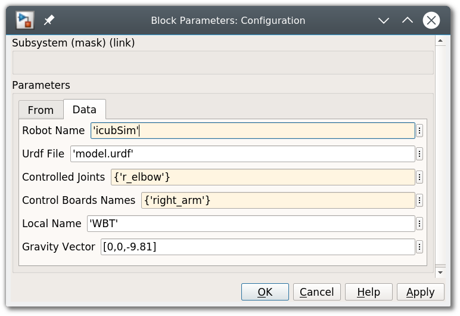

# Simulink and Gazebo

!!! example
    You can find the Simulink model created in this tutorial in the [examples/](examples/) folder

In this tutorial we show how to perform a co-simulation when both Simulink and Gazebo are involved. The two simulators by default use their own clock. In order to execute them synchronously, we need that:

1. The clock used by the two simulators is unique
2. One simulator is the master, and the other the slave

We are not going too much in detail about the implementation of this co-simulation setup, but we try below to clarify the its architecture which starts to be more complex with respect to the previous tutorials.

### Sharing the clock

The most intuitive choice of the clock for a co-simulation setup is using the time of the physic engine, that means Gazebo in this case. The robotology-superbuild already installed and configured the [gazebo-yarp-plugins](https://github.com/robotology/gazebo-yarp-plugins) repository, that includes among other a plugin that streams the Gazebo clock to a YARP port. We will sync Simulink to use this network clock instead of the real-time clock, obtaining a synchronized co-simulation.

This time, we need to execute `yarpserver` and launch Gazebo with `gazebo -slibgazeboyarp_clock.so`. 

### Master and Slave

Once that the clocks are synced, we need to setup the master and the slave of the co-simulation . We provide a _Simulator Synchronizer_ block that acts very similarly to the _Real Time Synchronizer_. In this case, beyond assuring that the fixed step duration is respected, the simulator sinchronizer also sends a signal to Gazebo triggering the physics simulation steps. Under this view, Simulink acts as a master and Gazebo as a slave.

### The network interface

The `model.urdf` we used in the previous tutorial, beyond defining the description of the robot kinematics, also contains few gazebo plugins that expose a network interface of the simulated robot that matches the network interface of the real robot. Through these plugins we can get measurements and set references of a simulated robot by reading / writing YARP ports. This means that data shared between Simulink and Gazebo pass through the YARP middleware.

!!! note
    Beyond mere IPC feature, this setup allows us to use the very same Simulink model to control both simulated and real robot, where the only difference between these two setups is the name of the YARP ports of the endpoint.

### Simulink model to actuate a robot joint

Create a blank Simulink model and configure the solver to use a fixed-step as explained in the previous tutorial. Drop a _Simulator Synchronizer_ block and a _Configuration_ block. Fill the _Configuration_ block as follows:

Without entering in details, joints of YARP-based robots are typically grouped in sets called _control boards_. We want to control the `r_elbow` joint that is contained in the `right_arm` control board. Furthermore, we need to set the **Robot Name** which defines the name of the YARP ports of the endpoint (the simulated robot).

Now the `r_elbow` is configured as controlled joint. Complete the following Simulink model that allows sending a sinusoidal reference in open loop: 

If the YARP server and Gazebo are running and everything else is configured properly, pressing the _Play_ button should start the simulation. You should see that the right elbow of the robot moves as expected. You can also inspect if the trajectory is followed from the scope.