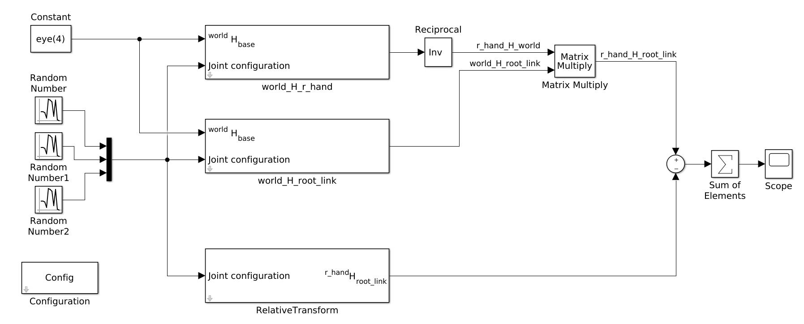

# Using model blocks

!!! example
    You can find the Simulink model created in this tutorial in the [examples/](examples/) folder

### Explore the urdf model

In this tutorial we will use blocks that expose iDynTree functionalities to compute canonical rigid-body dynamics quantities. We will use the robot description of the humanoid iCub stored in [icub-models](https://github.com/robotology/icub-models).

If your system is properly configured, iDynTree commands should be available in your path. First, locate the `model.urdf` file in your filesystem.

!!! tip
    You should find it in `<build>/install/share/iCub/robots/iCubGazeboV2_5/model.urdf`, where `<build>` is the build folder of the superbuild repository.

You should be able to execute the following command, that prints a recap of the urdf model listing joints, links, and frames:

```bash
idyntree-model-info -p -m /absolute/path/to/model.urdf
```

We are going to develop a Simulink model that computes in two ways the relative transform between `root_link` and `r_hand`.

### Configuration block

Create a blank Simulink model and configure the solver to use a fixed-step as explained in the previous tutorial.

The model is configured through a _Configuration_ block. Select _Mask_ as configuration source, and fill the _Data_ tab as follows:


The only important sections are the **Urdf File** containing the absolute path of the file `model.urdf` and the **Controlled Joints** that list the degrees of freedom of the robot we want to control. In this case we can operate on the joint angles of the three listed joints.

There are other entries in this _Configuration_ block, but they go beyond the scope of this tutorial since they are required to interface with a YARP robot in order to get measurement and set references.

!!! note
    We used the absolute path to the urdf file to simplify the tutorial. On a typical system we use the filesystem resources provided by YARP to locate files, that allows us to store only the file name.

### iDynTree blocks

Then, using the _Relative Transform_ and _Forward Kinematics_ block try to obtain the following model:



The upper part of this models combines the output of two _Forward Kinematics_ blocks to compute the  ${}^{r\_hand}H_{root\_link}$ transform, and compares the output with another block that uses the same model and directly provides the same transform. Three blocks generating random numbers define during every simulation loop a new joint configuration (associated to the three joints configured in the _Configuration_ block). The two transform are then subtracted element-wise and summed.

Pressing the _Play_ button, the model parses the model stored in the `urdf` file, configures the joints angles, and provides at every simulation loop the requested transforms. We can visualize the difference of the two noticing the they match almost precisely (excluding small numerical rounding):


Whole-Body Toolbox provides a many rigid-body dynamics resources that can be used to quickly build complex controllers, have a look for instance to _Inverse Dynamics_, _Jacobian_, _Mass Matrix_, and _QP_.